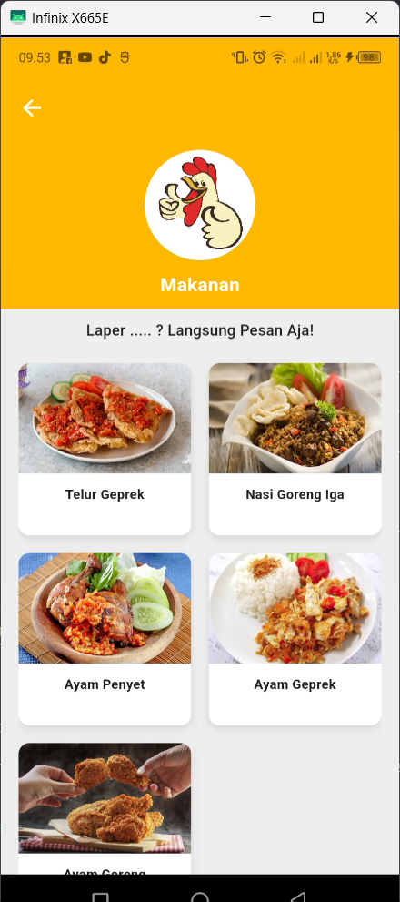

# 🎯 Mobile Application to use API of Order Making System

This repository contains the **Mobile Application** for managing food orders and appointments with a food store. It integrates with the **Admin Panel API** to allow users to place orders, track their status, and manage appointments via their mobile devices.

---

## Features

### Mobile Application
1. **User-Friendly Interface**: Simple navigation to view and place orders.
2. **Order Management**: View and track order statuses.
3. **Appointment Scheduling**: Set appointments for food orders based on store availability.
4. **Product Categories & Details**: Browse products by categories and view detailed descriptions.
5. **Secure Authentication**: Login with JWT for secure access.

### API Integration
1. **Authentication**: Secure login with JWT token for user verification.
2. **Product Management**: Fetch product categories and product details via API.
3. **Order Management**: Create and manage orders through API endpoints.
4. **Real-Time Features**: Appointment scheduling and order status updates in real-time.

---

## Installation

### Requirements
- **Flutter SDK** >= 3.3.4
- Android Studio or Visual Studio Code
- Internet connection for API calls

### Steps
1. Clone the repository:
   ```bash
   git clone https://github.com/naufalfirman23/mobile-making-order-system-client.git
2. Navigate to the project directory:
    ```bash
    cd food-ordering-system-mobile
4. Install dependencies:
   ```bash
    flutter pub get
5. Configure the API base URL in the lib/const/capi.dart file.
6. Ask the Author on : [Calling Me!](https://api.whatsapp.com/send/?phone=6282265057386&text&type=phone_number&app_absent=0)   
8. Run the application on an emulator or physical device:
   ```bash
   flutter run

---

##Screenshots
<p align="center">
  
  
  
</p>

<p align="center">
  
  
  
</p>

<p align="center">
  
  
  
</p>

<p align="center">
  
  
  
</p>

<p align="center">
  
  
  
</p>

<p align="center">
  
  
  
</p>

---

## Authors

| Name             | Email                      |
|------------------|----------------------------|
| Naufal Developer | tompelart17@gmail.com      |


---

## License

This project is licensed under the [MIT License](LICENSE).
